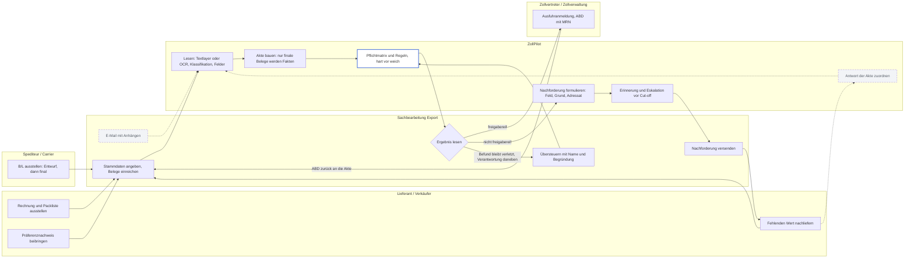
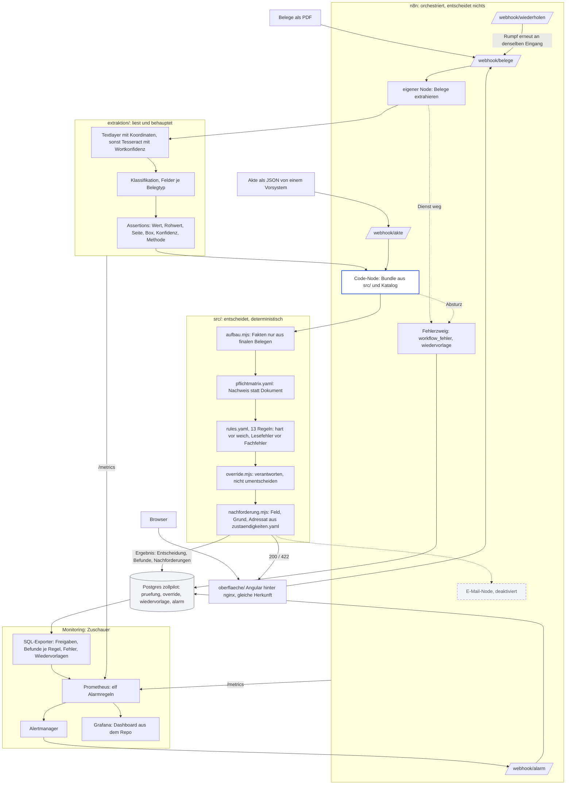

# Prozesslandschaft und Datenfluss

Drei Artefakte, die eine Ausschreibung wörtlich verlangt: eine
Prozesslandschaft, ein Datenflussdiagramm, ein Betriebshandbuch. Die ersten
beiden stehen hier, das dritte ist [BETRIEB.md](../BETRIEB.md) mit einem
Runbook je Alarm.

Die Diagramme zeigen den **Zielprozess** aus
[05-prozess-nachforderung.md](../05-prozess-nachforderung.md) und markieren,
was davon gebaut ist. Das ist die Regel dieses Repos: Was noch nicht
existiert, steht als Ziel mit Status da, nicht weggelassen und nicht
behauptet. Gestrichelt ist vorgesehen, durchgezogen ist gebaut und im
Rauchtest bewiesen.

Dieselbe Prozesslandschaft liegt als BPMN 2.0 in
[sendungsakte.bpmn](sendungsakte.bpmn), mit Pool, Rollen als Lanes und
Layout, zum Öffnen in Camunda Modeler oder bpmn.io. Erzeugt aus einer
Beschreibung des Prozesses, nicht gezeichnet; Änderungen gehören in die
Beschreibung.

## Prozesslandschaft

Fünf Rollen, eine Akte. Die Sachbearbeitung Export ist heute der Einstieg;
der Zielprozess beginnt beim Postfach.

Was die Linien bedeuten:

| Linie | Stand | Beleg |
|---|---|---|
| Belege einreichen, lesen, Akte bauen, prüfen, Ergebnis lesen | gebaut | `scripts/rauchtest.sh`, Runden 1 bis 3 |
| Übersteuern | gebaut | Runde 4, ADR-007 |
| Nachforderung formulieren | gebaut | `src/nachforderung.mjs`; der Text steht im Ergebnis und in der Oberfläche |
| ABD zurück an die Akte | gebaut auf dem Branch `extraktion` | Belegtyp ABD, Regel CUS-05, Pflicht PFL-07 |
| E-Mail als Eingang | vorgesehen | `docs/OFFENE-PUNKTE.md`, „Kein Mail-Intake“ |
| Nachforderung versenden, Erinnerung, Eskalation | gebaut | Runde 8, ADR-009: Fälle in `request_case`, Stufen relativ zu den Cut-offs der Akte, Versand an das Postfach, festgehalten in `request_versand` |
| Antwort der Akte zuordnen | vorgesehen | der Rückweg aus `docs/OFFENE-PUNKTE.md` |

## Datenfluss

Von der Datei zur Entscheidung, und von der Entscheidung zu denen, die
hinsehen. Das Monitoring ist Zuschauer: Kein Pfeil führt von dort zurück
in die Akte.

Drei Zusagen, die das Bild zeigt:

- **Ein Modell steht nie rechts von der Extraktion.** Die Assertions
  tragen Konfidenz; alles danach ist deterministisch (ADR-003).
- **Der Code-Node ist ein Build-Artefakt.** Was in `src/` steht, steht im
  Node, und `scripts/n8n-bundle.mjs --check` hält das (ADR-004).
- **Das Monitoring liest, es schreibt nicht in die Akte.** Der einzige
  Rückweg ist der Alarm als Zeile in `alarm`, und die liest niemand
  automatisch.

## Betriebshandbuch

[BETRIEB.md](../BETRIEB.md): was läuft, ein Befehl, wo etwas steht, elf
Alarme mit Prüfen und Handgriff, was Support tun kann, Geheimnisse, und
was vor einem echten Betrieb fehlt.

## Was diese Diagramme nicht sind

Kein Ist-Prozess eines Kunden. Die Rollen und Auslöser stammen aus der
Recherche in `docs/05`, nicht aus einer Aufnahme vor Ort. Welche Ebene die
Akte hat (Bestellung, Rechnung, Container, MRN) und wer bei Konflikten
gewinnt, sind offene Fragen an den Auftraggeber (`PROJECT.md`, Abschnitt
11). Ein Diagramm, das das schon wüsste, würde raten.
