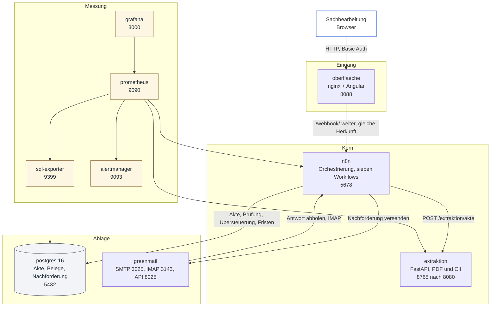

# Systemlandschaft

Was läuft, wo es läuft, womit es spricht. Die Prozesssicht steht in
[README.md](README.md) daneben: Dort geht es um die Akte und ihre Rollen,
hier um Container, Ports und Datenwege. Wer den Stack übernimmt, liest diese
Seite zuerst und dann das Betriebshandbuch
([BETRIEB.md](../BETRIEB.md)) für Alarme und Handgriffe.

Alles läuft mit `docker compose up -d --wait` auf einer Maschine. Jeder Port
ist an `127.0.0.1` gebunden; von außen ist nichts erreichbar, auch nicht die
Datenbank. Das ist Absicht und zugleich die größte Lücke zu einem echten
Betrieb (`docs/BETRIEB.md`, „Was vor einem echten Betrieb fehlt").

## Die Karte

Ein zehnter Container fehlt in der Karte, weil er nur einmal läuft:
`n8n-import` schiebt beim Start die Workflows aus `workflows/` und die
Zugangsdaten aus `deploy/n8n/credentials.json` in die Datenbank und endet
dann. Deshalb ist ein Workflow nie von Hand im Editor entstanden; der Editor
zeigt, was im Repo steht (ADR-004).

## Die Container

| Container | Bild | Port (nur localhost) | Wofür | Was bleibt |
|---|---|---|---|---|
| `oberflaeche` | `zollpilot-oberflaeche:dev` | 8088 | Angular-Oberfläche, ausgeliefert von nginx; reicht `/webhook/` an n8n weiter und hängt den angemeldeten Namen als Kopfzeile an | nichts |
| `n8n` | `n8nio/n8n:1.114.0` | 5678 | Orchestrierung: sieben Workflows, eigener Node für die Extraktion, Code-Nodes aus `src/` gebündelt | `n8n-daten` |
| `extraktion` | `zollpilot-extraktion:dev` | 8765 nach 8080 | Belege lesen: Textlayer oder OCR mit Koordinaten, CII als Datensatz, Assertions mit Konfidenz | nichts |
| `postgres` | `postgres:16-alpine` | 5432 | Akte, Dokumente, Assertions je Prüfung, Übersteuerung, Nachforderung, Mail-Eingang, Fehler | `postgres-daten` |
| `greenmail` | `greenmail/standalone:2.1.8` | 3025, 3143, 8025 | Postfach für Entwicklung: Nachforderungen raus, Antworten rein | nichts |
| `prometheus` | `prom/prometheus:v3.5.0` | 9090 | Sammelt Zähler von n8n, Extraktion und Datenbank | `prometheus-daten` |
| `sql-exporter` | `burningalchemist/sql_exporter:0.18.0` | 9399 | Macht Zahlen aus der Akte messbar: offene Nachforderungen, Fristen, Fehler | nichts |
| `alertmanager` | `prom/alertmanager:v0.28.1` | 9093 | Alarme bündeln und zustellen | nichts |
| `grafana` | `grafana/grafana:12.1.0` | 3000 | Bildschirm für den Betrieb | `grafana-daten` |
| `n8n-import` | `n8nio/n8n:1.114.0` | keiner | Einmalig beim Start: Workflows und Zugangsdaten importieren, dann Ende | nichts |

## Die Wege im Einzelnen

**Eine Sendung kommt herein.** Der Browser lädt die Oberfläche von nginx.
Das Formular schickt Stammdaten und PDFs an `/webhook/akte`, nginx reicht das
an n8n weiter. Weil beides unter derselben Herkunft liegt, braucht es kein
CORS (ADR-006). Basic Auth am Proxy liefert den Namen, der später an einer
Übersteuerung steht.

**Die Belege werden gelesen.** n8n schickt die Dateien als Base64 an
`extraktion`. Zurück kommt eine Akte aus Dokumenten und Assertions, jede mit
Fundstelle und Konfidenz. Die Extraktion entscheidet nichts und ruft kein
Modell (ADR-003, ADR-005).

**Es wird entschieden.** Ein Code-Node in n8n, gebündelt aus `src/`, wendet
Pflichtmatrix und Regeln an. Ergebnis und Akte gehen nach Postgres, nur
anhängend (ADR-010).

**Was fehlt, wird nachgefordert.** Ein eigener Workflow macht aus fehlenden
Feldern einen Vorgang mit Frist und schickt eine Mail über SMTP. Die Antwort
holt der Posteingangs-Workflow über IMAP ab, ordnet sie über das Aktenzeichen
zu und stößt die Prüfung erneut an (ADR-009).

**Es wird gemessen.** Prometheus holt Zähler bei n8n und der Extraktion ab;
der SQL-Exporter macht aus der Akte selbst Messwerte, etwa offene
Nachforderungen je Frist. Was schiefgeht, landet über Alertmanager als Alarm,
mit einem Runbook je Alarm in `docs/BETRIEB.md`.

## Was hier bewusst fehlt

- **Kein DMS und kein ERP.** Die Ablage ist Postgres, das Ziel eines echten
  Betriebs wäre ein Dokumentenmanagement. Die Stelle dafür ist benannt
  (`docs/ANFORDERUNGEN.md`, A6), gebaut ist sie nicht.
- **Kein zweiter Knoten.** Ein Compose auf einer Maschine, keine
  Ausfallsicherheit, keine Warteschlange vor n8n.
- **Keine Rollen.** Ein Owner in n8n, ein Basic-Auth-Bereich am Proxy. Für
  einen Betrieb bräuchte es eine echte Anmeldung (ADR-007, offen).
