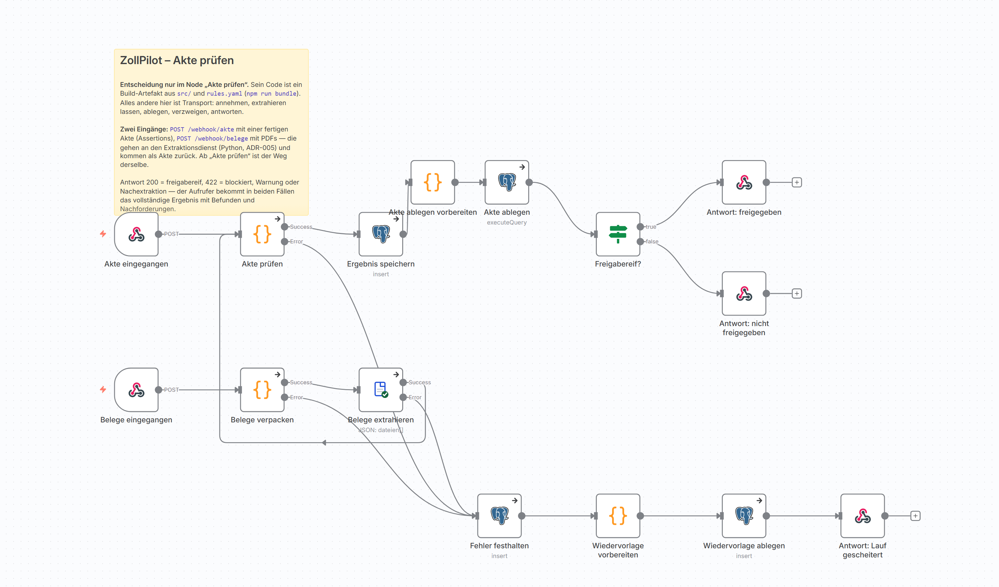
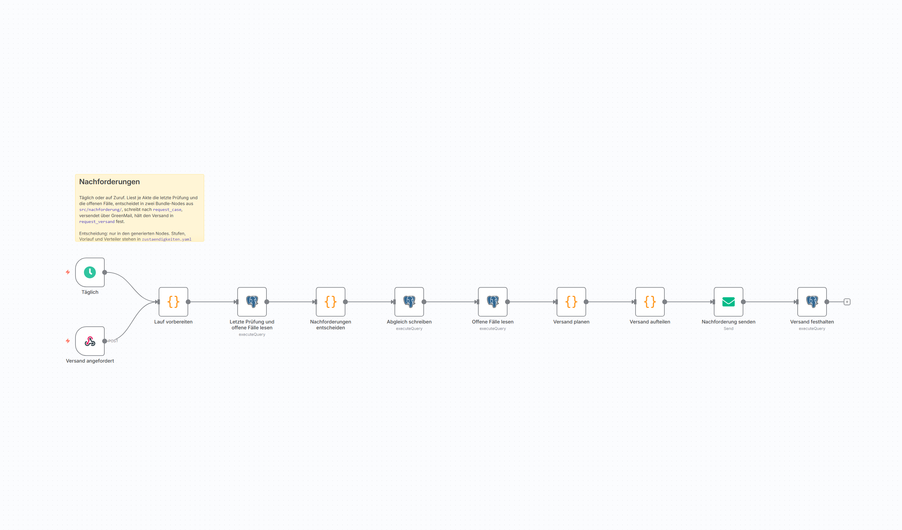
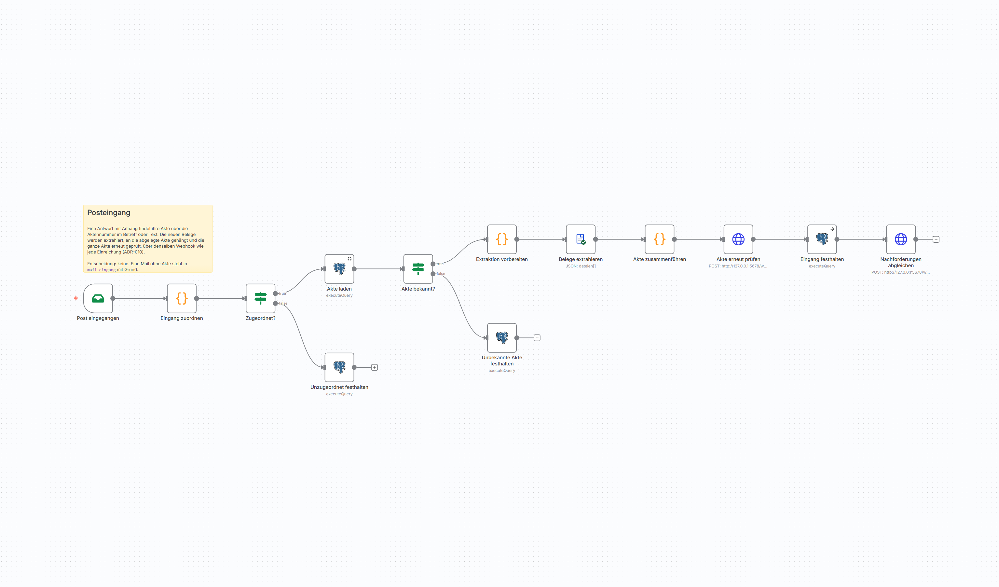
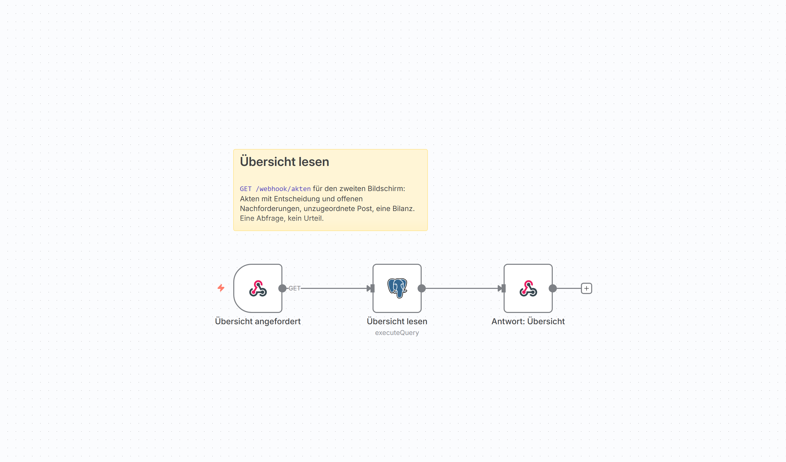
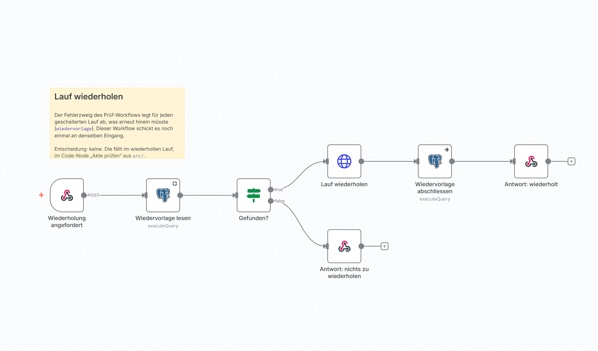
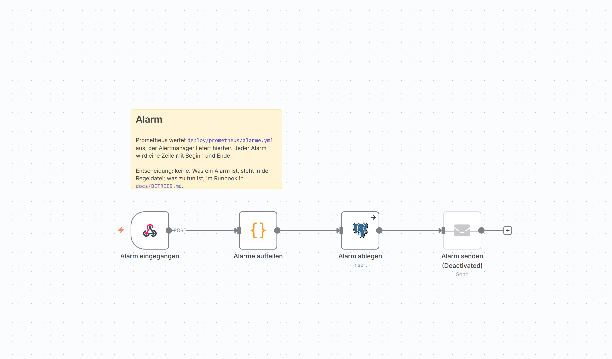
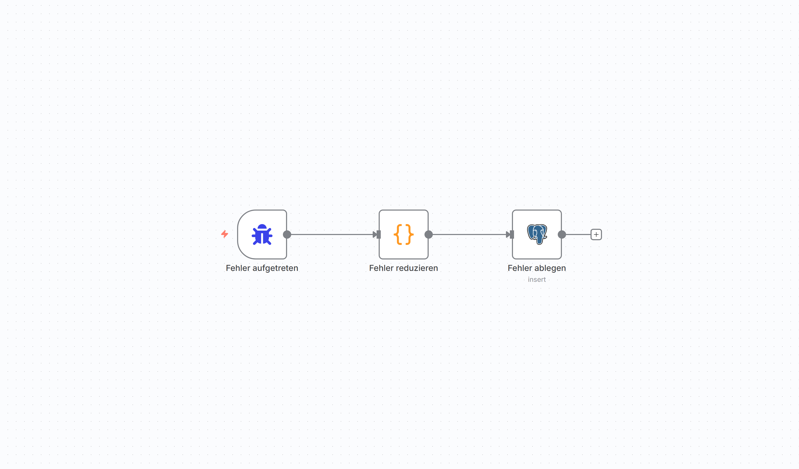

# Die sieben Workflows

Was in n8n läuft, als Bild. Die Bilder kommen aus dem laufenden Editor und
werden mit `node scripts/bilder-ziehen.mjs` neu gezogen, nicht abfotografiert;
ein Gate meldet, wenn zu einem Workflow das Bild fehlt.

Eine Regel gilt für alle sieben, und sie ist der Grund, warum sich die Bilder
lohnen: **Entschieden wird nur in den Code-Nodes, die aus `src/` gebündelt
sind.** Alles andere ist Transport, also annehmen, weiterreichen, ablegen,
verzweigen, antworten. Wer die Bilder durchsieht, kann das nachzählen. Das ist
ADR-004, und ein Bild belegt es schneller als ein Absatz.

Die Quelle bleibt die JSON-Datei unter [workflows/](../../workflows/). Kein
Workflow ist im Editor entstanden; ein eigener Container schiebt sie beim
Start in die Datenbank.

## Akte prüfen

Der Hauptweg. Zwei Eingänge: `POST /webhook/akte` nimmt eine fertige Akte aus
Assertions, `POST /webhook/belege` nimmt PDFs, schickt sie an den
Extraktionsdienst und bekommt dieselbe Akte zurück. Ab dem Node „Akte prüfen"
ist der Weg derselbe. Die Antwort ist 200 bei freigabereif und 422 bei
blockiert, in beiden Fällen mit allen Befunden und Nachforderungen.

Der untere Zweig ist der Fehlerweg: Was in Extraktion, Prüfung oder Ablage
scheitert, wird festgehalten und als Wiedervorlage abgelegt, damit der Lauf
später wiederholt werden kann. Der Aufrufer bekommt dann 500 mit der
Ausführungsnummer.

## Nachforderungen

Läuft täglich, auf Zuruf auch sofort über `POST /webhook/nachforderungen`.
Liest je Akte die letzte Prüfung und die offenen Fälle, entscheidet in zwei
Nodes aus `src/nachforderung/`, welche Nachforderung neu ist, welche erinnert
und welche eskaliert wird, schreibt das Ergebnis als Vorgang und versendet die
Mail. Was rausging, steht danach in der Ablage (ADR-009).

## Posteingang

Die Gegenrichtung zur Nachforderung. Holt Antworten per IMAP ab und sucht die
Akte über das Aktenzeichen in Betreff oder Text. Die neuen Belege gehen durch
dieselbe Extraktion, werden an die abgelegte Akte gehängt, und die ganze Akte
wird erneut geprüft, über denselben Eingang wie jede Einreichung. Eine Mail
ohne erkennbare Akte wird nicht verworfen, sondern als unzugeordnet
festgehalten (ADR-010).

## Übersicht lesen

`GET /webhook/akten` für den Übersichtsbildschirm: Akten mit Entscheidung und
offenen Nachforderungen, unzugeordnete Post, eine Bilanz. Drei Nodes, eine
Abfrage, kein Urteil.

## Lauf wiederholen

`POST /webhook/wiederholen` mit einer Ausführungsnummer schickt einen
gescheiterten Lauf noch einmal an denselben Eingang und schließt die
Wiedervorlage. Findet sich nichts, sagt der Workflow das, statt still nichts
zu tun. Entschieden wird auch hier nichts: Die Entscheidung fällt im
wiederholten Lauf.

## Alarm

Prometheus wertet die Regeldatei aus, der Alertmanager liefert hierher. Jeder
Alarm wird eine Zeile mit Beginn und Ende. Was ein Alarm ist, steht in der
Regeldatei; was zu tun ist, im Runbook in [BETRIEB.md](../BETRIEB.md). Der
Versand-Node ist abgeschaltet, weil es in der Entwicklung niemanden zu wecken
gibt.

## Fehler

Der Auffangworkflow von n8n selbst. Er greift, wenn ein anderer Workflow
abbricht, reduziert den Fehler auf das, was ohne Belegtext aussagekräftig ist,
und legt ihn ab. Drei Nodes, und der einzige ohne Webhook.

